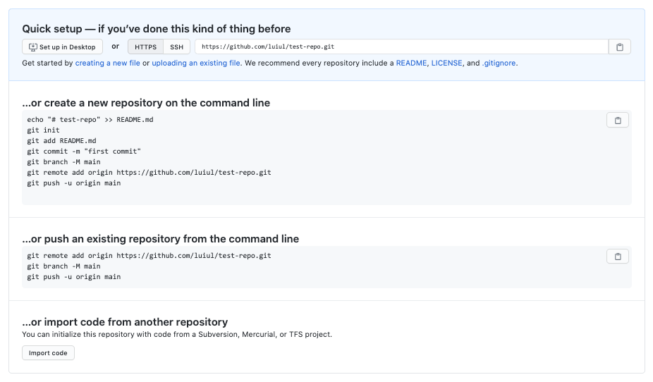

# Git Basics
Test repository to learn and practice the basics of version control with Git

# 👣 Basic Commands

## Basics
* `git help <command>`: get help for a git command
* `git init`: creates a new git repo, with data stored in the .git directory
* `git status`: tells you what’s going on
* `git add <filename>`: adds files to staging area
* `git commit`: creates a new commit
* `git log`: shows a flattened log of history
* `git log --all --graph --decorate`: visualizes history as a DAG
* `git diff <filename>`: show changes you made relative to the staging area
* `git diff <revision> <filename>`: shows differences in a file between snapshots
* `git checkout <revision>`: updates HEAD and current branch

## Branching and merging
* `git branch`: shows branches
* `git branch <name>`: creates a branch
* `git checkout -b <name>`: creates a branch and switches to it (same as `git branch <name>; git checkout <name>`)
* `git merge <revision>`: merges into current branch
* `git mergetool`: use a fancy tool to help resolve merge conflicts
* `git rebase`: rebase set of patches onto a new base


## Remotes
* `git remote`: list remotes
* `git remote add <name> <url>`: add a remote
* `git push <remote> <local branch>:remote branch>`: send objects to remote, and update remote reference
* `git branch --set-upstream-to=<remote>/<remote branch>`: set up correspondence between local and remote branch
* `git fetch`: retrieve objects/references from a remote
* `git pull`: same as git fetch; git merge
* `git clone`: download repository from remote



## Undo
* `git commit --amend`: edit a commit’s contents/message
* `git reset HEAD <file>`: unstage a file
* `git checkout -- <file>`: discard changes


## Advanced Git
* `git config`: Git is highly customizable
* `git clone --depth=1`: shallow clone, without entire version history
* `git add -p`: interactive staging
* `git rebase -i`: interactive rebasing
* `git blame`: show who last edited which line
* `git stash`: temporarily remove modifications to working directory
* `git bisect`: binary search history (e.g. for regressions)
* `.gitignore`: specify intentionally untracked files to 


# 📖 Version Control (Git) - MIT Course

Version Control are tools to keep track of the history changes done to source code / collections of files or folders (in a series of snapshots + metadata, e.g. author, date and timestamp of a change or messages) > facilitate collaboration and allows the user to: 

- look at old version of source code
- reasons for change
- work in parallel w/out conflicts
- work on different features or bugs while keeping other features independent
- resoving conflicts
- sending patches and modules of codes around

## Files and Folders Abstraction Model

```
<root> (tree)
|
+- foo (tree)
|  |
|  + bar.txt (blob, contents = "hello world")
|
+- baz.txt (blob, contents = "git is wonderful")
```

Recursive data structure (i.e. data structure that is partially composed of smaller of simpler instances of the same data structure): tree can contain other trees (and blobs)

The root is the directory being tracked, i.e. folder on your computer corresponding to a software project

Directory: file which consists solely of a set of other files

## Modeling History

History can be modeled as a linear sequence of snapshots (i.e. all the files and folders in the project + metadata) > git uses a directed acyclic graph to model history > every new state points to the previous state in the graph

## Snapshots / Commits

```
o <-- o <-- o <-- o (base project + new feature)
            ^
             \
              --- o <-- o (bug fix)
```

Afterwards we can merge both forks and create a new state

```
o <-- o <-- o <-- o <-- o (base project + new feature + bug fixes)
            ^         /
             \       /
              -- o < 
```

(Merge conflicts = concurrent changes in the new state)

## Data Structure / Model of History

```
// a file is a bunch of bytes
type blob = array<byte>

// a directory contains named files and directories
type tree = map<string, tree | blob>

// a commit has parents, metadata, and the top-level tree
type commit = struct {
    parent: array<commit>
    author: string
    message: string
    snapshot: tree
}

// this are only references. For storage and distribution we use objects
```

## Objects and Content-Addressing

```
type object = blob | tree | commit
```

All objects are [content-addressed](https://en.wikipedia.org/wiki/Content-addressable_storage) > what git maintains is a set of objects in disk

```
objects = map<string, object> 
(objects = map<id, object>)

def store(object):
    id = sha1(object)
    objects[id] = object

def load(id):
    return objects[id]
```

We now can name the objects in the commits graph

Git maintains a set of objects and a set of references > a git repository stores objects and references

## References

Git maintains a set of objects and a set of references

```
//human readable name to object id
references = map<string, string>

def update_reference(name, id):
    references[name] = id

def read_reference(name):
    return references[name]

def load_reference(name_or_id):
    if name_or_id in references:
        return load(references[name_or_id])
    else:
        return load(name_or_id)
```

The graph is immutable, references are mutable

Git commands manipulates the references data or objects data

# 📚 Resources

[Version Control (Git)](https://missing.csail.mit.edu/2020/version-control/)

[Lecture 6: Version Control (git) (2020)](https://www.youtube.com/watch?v=2sjqTHE0zok)

# 💡 Misc

- Git does not track empty directories

[How to ignore certain files in Git](https://stackoverflow.com/questions/4308610/how-to-ignore-certain-files-in-git)

[How can I create a Git repository with the default branch name other than "master"?](https://stackoverflow.com/questions/42871542/how-can-i-create-a-git-repository-with-the-default-branch-name-other-than-maste)

[How to change the URI (URL) for a remote Git repository?](https://stackoverflow.com/questions/2432764/how-to-change-the-uri-url-for-a-remote-git-repository)

[git still shows files as modified after adding to .gitignore](https://stackoverflow.com/questions/9750606/git-still-shows-files-as-modified-after-adding-to-gitignore)

[git still shows files as modified after adding to .gitignore](https://stackoverflow.com/questions/9750606/git-still-shows-files-as-modified-after-adding-to-gitignore)

[gitignore.io](https://www.toptal.com/developers/gitignore)